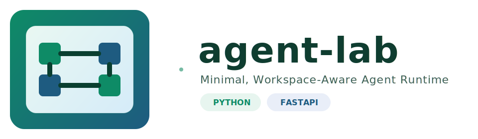

# agent-lab

<p align="center">
  
</p>


-0a7f5a)

Minimal agent runtime for Python 3.12 with a practical focus: tool calling, workspace-aware context injection, layered memory, OpenAI-compatible HTTP API, and a lightweight browser UI for interactive chat and log inspection.

## Why agent-lab

agent-lab is designed as a small but usable agent foundation rather than a framework-heavy platform. It keeps the core loop simple, exposes clear extension points, and adds the operational pieces that make local agent workflows practical:

- multi-provider LLM support
- tool execution with workspace isolation
- session persistence and layered memory
- OpenAI-compatible API for external integrations
- browser-based chat UI and log viewer

## Key Capabilities

- **Agent Loop**: iterative LLM -> tool -> result -> LLM execution with configurable max iterations
- **Provider Layer**: OpenAI-compatible and Anthropic-compatible backends, plus custom OpenAI-compatible gateways
- **Tool System**: JSON-schema-style tool definitions with registry-based execution
- **Workspace Context**: automatic loading of prompt files, profile, identity, memory, policies, skills, and knowledge catalog
- **Memory System**: session-local short-term memory plus shared user, agent-identity, and long-term memory layers
- **OpenAI-Compatible API**: `/v1/chat/completions` and `/v1/models` for external clients
- **Web UI**: session-based chat interface with settings, workspace-bound chats, and built-in log viewer
- **Logging**: structured JSONL and readable logs for LLM request/response tracing

## Technology Stack

- Python 3.12
- FastAPI
- Typer
- Pydantic v2 / pydantic-settings
- httpx
- Uvicorn
- Rich
- pytest / pytest-asyncio

## Quick Start

### 1. Install

```bash
pip install -e .
```

### 2. Initialize workspace

```bash
agent-lab init
```

Optional:

```bash
agent-lab init -w "d:/workspace/ws01"
```

### 3. Configure provider credentials

Edit `~/.agent-lab/config.json`:

```json
{
  "providers": {
    "openai": {
      "api_key": "sk-..."
    }
  },
  "agents": {
    "defaults": {
      "model": "gpt-4o",
      "provider": "openai"
    }
  }
}
```

### 4. Start chatting

```bash
agent-lab chat "What's in the current directory?"
```

### 5. Run the API server

```bash
agent-lab api --host 127.0.0.1 --port 8000
```

### 6. Run the Web UI

```bash
agent-lab web --host 127.0.0.1 --port 7860 --api-base http://127.0.0.1:8000
```

Open:

```text
http://127.0.0.1:7860
```

## Web UI

The built-in Web UI is intended for local usage, testing, and demonstrations.

- session-based chat list on the left
- `New Chat` flow with per-chat `workspace`, `session`, and optional `background`
- settings panel for API and inference parameters
- SSE streaming chat output
- independent log viewer page opened from the chat header
- local persistence of UI settings and chat metadata in the browser

The log viewer supports:

- reading `workspace/log/*.jsonl`
- sorting files by recent modification time
- full-text search
- filtering by `record_type` and `request_type`
- `request_id` paired request/response inspection

## OpenAI-Compatible API

agent-lab exposes an OpenAI-style interface so other tools can use it without custom protocol work.

Example request:

```bash
curl http://127.0.0.1:8000/v1/chat/completions \
  -H "Content-Type: application/json" \
  -d '{
    "model": "gpt-4o",
    "messages": [
      {"role": "user", "content": "hello"}
    ],
    "stream": false
  }'
```

Runtime context overrides supported by the API:

- `workspace`
- `background`
- `session`
- `session_mode`

Priority order:

- body > query > header > default config

## Core Commands

```bash
agent-lab init
agent-lab config show
agent-lab chat "message"
agent-lab chat -s session_name "message"
agent-lab chat -w "d:/workspace/ws01" "message"
agent-lab chat -b "d:/shared/background" "message"
agent-lab tools-list
agent-lab skills-list
agent-lab api --host 127.0.0.1 --port 8000
agent-lab web --host 127.0.0.1 --port 7860 --api-base http://127.0.0.1:8000
agent-lab service once
agent-lab service run
agent-lab service start
agent-lab service stop
```

## Architecture Overview

```text
User / Client
    |
    +-- CLI
    +-- Web UI
    +-- OpenAI-compatible API
            |
            v
         Agent
            |
    +-------+--------+
    |                |
    v                v
 ToolRegistry     Provider
    |                |
    v                v
 Workspace       LLM backend
 Context         (OpenAI / Anthropic / compatible)
```

Main package layout:

```text
agent_lab/
├── agent/          # Agent loop
├── api/            # OpenAI-compatible API server
├── config/         # Configuration schema and loader
├── memory/         # Memory manager and task queue
├── providers/      # LLM providers
├── skills/         # Skills loader
├── tools/          # Tool abstractions and built-ins
├── web/            # Browser UI and log viewer
├── workspace/      # Workspace bootstrap and structure
├── cli.py          # CLI entry point
└── session.py      # Session persistence
```

## Built-in Tools

- `read_file`
- `write_file`
- `list_dir`

## Memory Model

agent-lab uses layered memory rather than a single rolling summary:

- **short-term**: session-local compressed memory
- **user**: shared user profile and preferences
- **agent_identity**: shared agent behavior and capability notes
- **long_term**: durable cross-session rules and architecture facts

Memory organization is handled asynchronously through the background service and written to workspace-local memory files.

## Environment Variables

- `AGENT_LAB_WORKSPACE`
- `OPENAI_API_KEY`
- `ANTHROPIC_API_KEY`

## Documentation

- `doc/QUICKSTART.md` - detailed setup and usage guide
- `doc/ARCHITECTURE.md` - architecture and design decisions
- `doc/PROJECT_STRUCTURE.md` - package and folder reference
- `doc/SYSTEM_PROMPT_INJECTION.md` - prompt composition order
- `doc/MEMORY_OPTIMIZATION_2026_04.md` - memory strategy details

## Development

Install development dependencies:

```bash
pip install -e ".[dev]"
```

Run tests:

```bash
pytest
```

Quick verification:

```bash
python verify.py
```

## Extending agent-lab

- add custom tools via `Tool` + `ToolRegistry`
- add custom providers via `LLMProvider`
- add workspace skills under `workspace/skills/*/SKILL.md`
- customize prompt and memory behavior through workspace/config files

## Status

Current repository state is production-ready for MVP/local deployment workflows, with active iteration around Web UI, observability, and workspace-aware interaction.

## License

MIT
